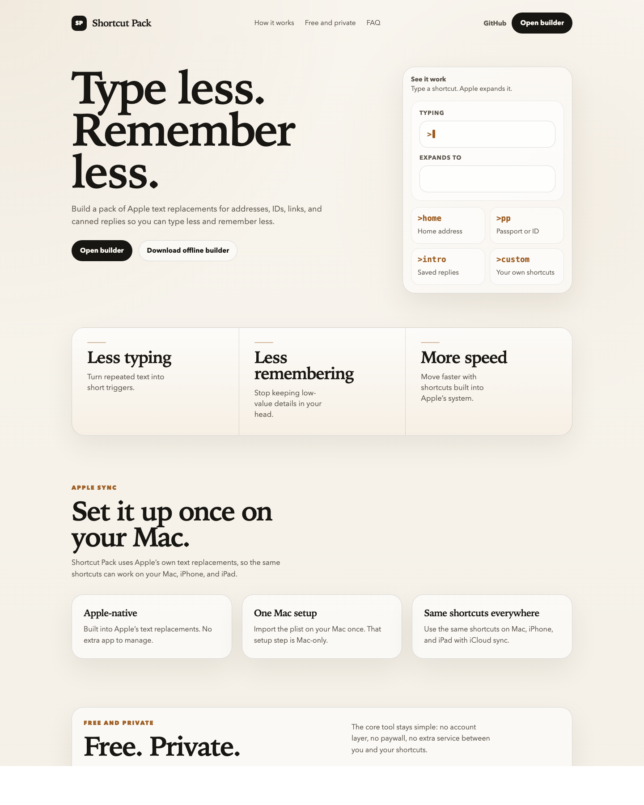
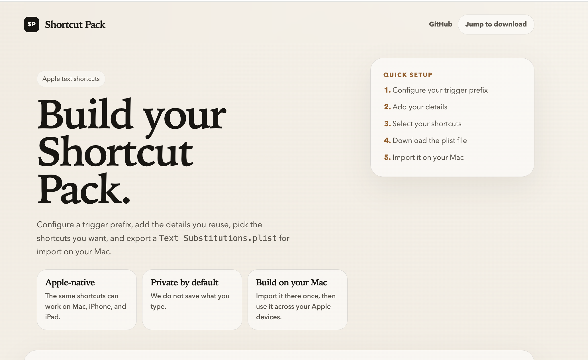

# Shortcut Pack

Shortcut Pack helps you turn repeated personal details, links, replies, and snippets into Apple text shortcuts you can actually use.

Start here: [shortcutpack.com](https://shortcutpack.com)

## Screenshots

Landing page:



Builder:



## What It Is

Shortcut Pack is a simple builder for Apple text replacements.

You fill in the details you reuse, keep the shortcuts you want, and export a `Text Substitutions.plist` file that macOS can import directly.

The import step is a Mac workflow. Once you import the file on your Mac, Apple can sync the resulting text replacements to your iPhone and iPad through iCloud.

## Why This Exists

Apple's built-in text replacement is great once it is set up, but setting it up is tedious.

- You have to invent a shortcut system from scratch.
- You have to add each entry one by one.
- You usually remember to do it when you are already busy.

Shortcut Pack removes the blank-page problem and gives you a usable system fast.

## Who It Is For

- People who type the same personal details again and again
- Founders, operators, recruiters, and assistants sending repetitive replies
- Anyone who likes Apple text replacement but has never taken the time to organize it properly

## What It Does

- Starts with sensible shortcut defaults for identity, links, addresses, and replies
- Lets you choose a shared trigger prefix like `>` or `@@`
- Shows live shortcut previews as you fill in your details
- Lets you edit every trigger and every expanded text value before export
- Supports custom shortcuts
- Skips blank fields instead of exporting placeholder text
- Exports a file macOS already knows how to import

## How To Use It

1. Go to [shortcutpack.com](https://shortcutpack.com).
2. Open the builder.
3. Fill in only the details you actually reuse.
4. Review the starter shortcuts, then change anything you want.
5. Download `Text Substitutions.plist`.
6. On your Mac, open `System Settings` -> `Keyboard` -> `Text Replacements`.
7. Drag the downloaded plist into the list.

Note: You can build the pack in any browser, but the plist import step works on Mac only.

## Privacy

Shortcut Pack is meant to feel safe to use for personal info.

- No signup
- No backend
- No saved personal data
- The offline builder works the same way if you would rather use a local file

## If You Want To Run It Locally

Most people should just use [shortcutpack.com](https://shortcutpack.com).

If you want the standalone local file instead, use [`generator.html`](./generator.html). Open it in any browser on your Mac and use it the same way as the website.

## If You Want To Edit The Defaults

The main source of truth is [`starter-pack.cjs`](./starter-pack.cjs).

That is where the built-in shortcut definitions live:

- categories
- default triggers
- descriptions
- placeholder text
- generated text logic

## Project Structure

- [`index.source.html`](./index.source.html): landing page source
- [`index.html`](./index.html): built landing page
- [`generator.source.html`](./generator.source.html): builder source
- [`generator.html`](./generator.html): built standalone builder
- [`styles.css`](./styles.css): styling
- [`app.js`](./app.js): browser logic and plist export
- [`starter-pack.cjs`](./starter-pack.cjs): default shortcut definitions
- [`build-standalone.mjs`](./build-standalone.mjs): rebuilds the standalone files

## Local Development

```bash
node build-standalone.mjs
node --check app.js
node --check build-standalone.mjs
node cli.mjs doctor
```

## License

[MIT](./LICENSE)
