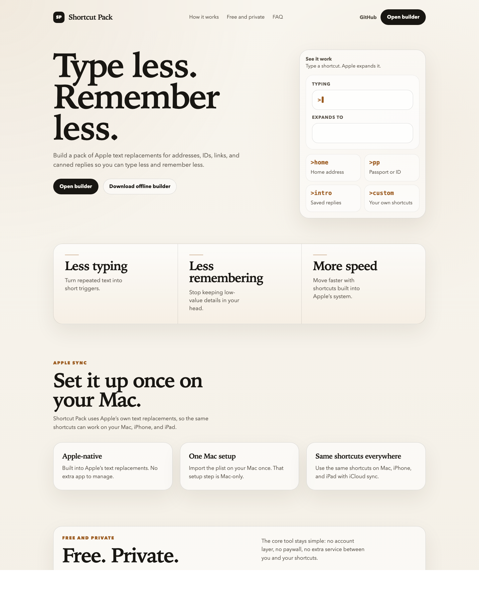
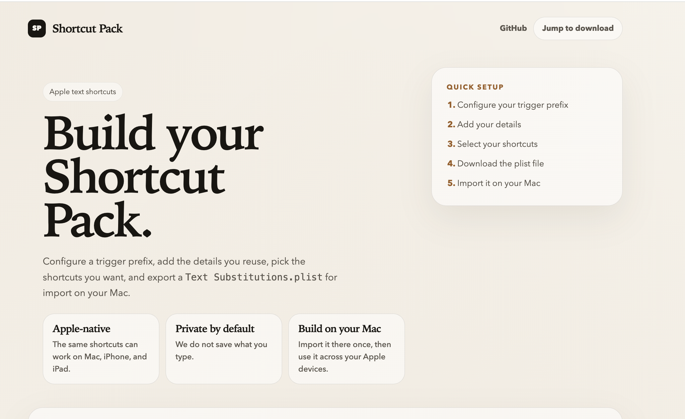

# Shortcut Pack

Build a personal pack of Apple text replacements for the details, links, and replies you type all the time.

[Open Shortcut Pack](https://shortcutpack.com) · [Download the offline builder](https://shortcutpack.com/shortcut-pack-offline.html) · [Read the story behind it](https://aadil.blog/2026/04/22/shortcut-pack-type-less-remember-less/)

Shortcut Pack is free, requires no account, and exports a native `Text Substitutions.plist` file that macOS can import directly.

## See It In Action

| Pick the packs you need | Build and customize your shortcuts |
| --- | --- |
|  |  |

## What You Can Build

Choose any combination of four focused starter packs:

- **Personal:** name, email, phone, and home address
- **Work:** intro reply, signature, and scheduling link
- **Travel:** passport details, Known Traveler Number, and airline loyalty number
- **Founder:** bio, website, social profiles, and scheduling link

From there, you can:

- Choose a shared trigger prefix such as `>`, `-`, `@@`, or your own
- Fill in only the details you want to use
- Preview shortcuts as you type
- Edit any trigger or expanded phrase
- Add completely custom shortcuts
- Skip blank fields automatically
- Combine or remove packs without losing your work
- Export only the shortcuts you enabled

For example, `>em` can expand to your email address and `>intro` can expand to a full reusable reply.

## How To Use It

1. Open [shortcutpack.com](https://shortcutpack.com) and select one or more starter packs.
2. Choose a trigger prefix and add the details you reuse.
3. Review the generated shortcuts, customize them, and add your own.
4. Download `Text Substitutions.plist`.
5. On your Mac, open **System Settings → Keyboard → Text Replacements**.
6. Back up your existing replacements: select one row, press `Command-A`, then drag the selected rows to your Desktop or a Finder folder.
7. Drag `Text Substitutions.plist` into the Text Replacements window and click **Done** if prompted.

The import step requires a Mac. After import, iCloud can sync the text replacements to your iPhone and iPad.

## Privacy And Local Drafts

Shortcut Pack has no signup, account, or application backend. The app code does not submit the contents of your shortcuts to a Shortcut Pack server.

The builder does save your working draft—including profile fields, selected shortcuts, custom rows, and active packs—to your browser's local storage so your work is still there when you return. Use **Clear local draft** in the builder to remove it from that browser.

The hosted version loads Vercel Web Analytics for site-traffic measurement; the builder code does not add your shortcut content to analytics events.

For a fully local workflow, download [`shortcut-pack-offline.html`](./shortcut-pack-offline.html) and open it directly in a browser. It uses the same local-draft behavior, so clear the saved draft after exporting if you are on a shared computer.

## Run It Locally

This project has no runtime dependencies. Clone the repository, then build and check it with Node.js:

```bash
npm run build
npm run doctor
node --check app.js
node --check build-standalone.mjs
```

The build creates two builder artifacts:

- [`generator.html`](./generator.html) is the lightweight web version and loads local CSS and JavaScript files.
- [`shortcut-pack-offline.html`](./shortcut-pack-offline.html) is a self-contained file with everything embedded for offline use.

Edit the source files rather than the generated HTML, then run `npm run build` again.

## Command-Line Helpers

The repository also includes a small CLI for browsing the generic starter set and checking the local Mac setup:

```bash
npm run list
npm run generate -- --prefix=@@ --format=markdown
npm run doctor
npm run setup
```

`setup` opens macOS Keyboard settings when possible. `generate` supports `text`, `markdown`, and `json` output.

## Project Structure

- [`index.source.html`](./index.source.html) — landing-page source
- [`generator.source.html`](./generator.source.html) — builder markup source
- [`styles.css`](./styles.css) — builder styles
- [`app.js`](./app.js) — builder state, previews, validation, and plist export
- [`starter-pack.cjs`](./starter-pack.cjs) — source of truth for built-in shortcut definitions
- [`build-standalone.mjs`](./build-standalone.mjs) — generates the web and offline artifacts
- [`cli.mjs`](./cli.mjs) — command-line helpers

## License

[MIT](./LICENSE)
